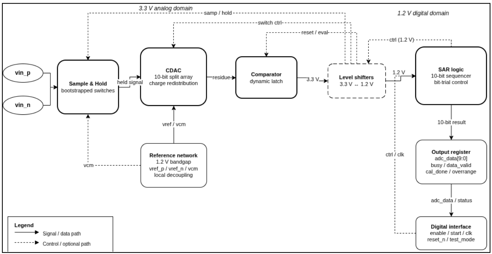

# 10-Bit SAR ADC — Chipalooza Challenge

Mixed-signal IP: a 1 MS/s, 10-bit differential-input successive-approximation-register ADC, targeting the IHP SG13CMOS5L 130nm process.

## Team

| Name | Email |
|---|---|
| Arjun Ananth | arjunananth200@gmail.com |
| Man Yu | manyu@manyu.xyz |
| Kelvin Olonade | olonadekelvin@gmail.com |

## Overview

- **IP type:** Mixed-signal — 1 MS/s, 10-bit differential-input SAR ADC
- **Target process:** IHP SG13CMOS5L
- **Application:** Reusable converter for sensor interfaces, monitoring circuits, and general-purpose SoC integration

## Block Diagram



Signal path: differential input (`vin_p`/`vin_n`) → bootstrapped-switch sample & hold → 10-bit split-array CDAC (charge redistribution) → dynamic-latch comparator → 1.2V↔3.3V level shifters → SAR sequencer → output register (`adc_data[9:0]`, status flags) → digital interface. A 1.2V bandgap reference network supplies `vref_p` / `vref_n` / `vcm` to the CDAC and sample-and-hold.

## Architecture

- Active differential input sampling
- Dynamic comparator
- Differential capacitive DAC (VCM-based monotonic switching)
- SAR control logic
- Digital calibration (optional)
- Output register and conversion-status logic
- SPI output interface
- Pipelined operation (if needed)

## Conversion Sequence

1. Differential input sampled onto the CDAC
2. Input sampling switches open
3. SAR controller applies the MSB trial code to the DAC
4. Comparator resolves the polarity of the DAC residue
5. Result stored; steps 3–4 repeat for the remaining bits
6. Final 10-bit code transferred to the output register
7. End-of-conversion status flag asserted
8. Result read out over SPI

## Pinout

| Analog I/O & refs | Supplies | Digital inputs | Digital outputs |
|---|---|---|---|
| Vinp | Vdda – 3.3V | Enable | SPI (4 pins) |
| Vinn | Vssa – 0V | Start | Test points for MSBs (optional) |
| Vref_p | Vddd – 1.2V | Clk | Comp_test |
| Vref_n | Vssd – 0V | Reset_n | |
| Vcm | | test_mode | |
| | | iDAC[4:0] | |

Up to 16 digital control/test signals over a simple SPI control/status bus.

## Target Specifications

| Parameter | Min | Nominal | Max |
|---|---|---|---|
| Resolution | | 10 bits | |
| ENOB | 9 bits | | |
| Sampling rate | | 1 MS/s | |
| SAR clock | | 15 MHz | |
| Conversion cycles | 12 | | 14 |
| DNL | | | ±1 LSB |
| INL | | | ±1 LSB |
| Offset error | | | ±2 LSB |
| Gain error | | | 1% of FS |
| Total error | No missing codes (nominal) | | ±3 LSB |
| Input leakage | | | 200 nA |
| SFDR | 60 dB | | |
| SNDR | 55 dB | | |
| SNR | 55 dB | | |
| Input bandwidth | | 500 kHz | |
| Comparator input-referred noise | | | 250 µV RMS |
| CDAC settling error | | | 0.25 LSB |
| Power consumption | | | 5 mW |

## Verification Plan

Top-level checks: schematic-level transient sim, static code-density sim, PVT-corner sim, extracted post-layout sim, DRC/LVS, and mixed-signal full-conversion sim.

- **Sampling front-end** — charge injection, clock feedthrough, leakage/droop, linearity (THD/SNDR/SFDR at 10k/100k/250kHz and near Nyquist)
- **Comparator** — decision polarity, input-referred offset, transition point, noise histogram, metastability probability, decision-time across corners
- **CDAC** — unit-cap nominal + mismatch (Monte Carlo), parasitic extraction, full 1024-code sweep for DNL/INL, boundary and settling behavior
- **SAR control** — FSM state/transition coverage, assertions, toggle coverage, timing
- **Level shifters** — 1.2V↔3.3V transitions, cross-domain delay from SAR output through the shifter and bootstrap switch to CDAC settling
- **Full ADC** — ramp-based DNL/INL/missing-code check; near-full-scale sine for SFDR/SNDR/SNR/ENOB; input leakage, bandwidth, and power (max/average/standby)

**Silicon bring-up:** continuity check → apply 1.2V/3.3V supplies → hold in reset → measure static current → enable and check reset behavior → enable clock, apply mid-scale input, trigger a conversion → sweep zero/mid/full-scale → DC transfer-function ramp (~10 hits/code) → sample-rate sweep → hot/cold corner test.

**Success criteria:** functional 10-bit conversion, no missing codes, ENOB ≥ 9 bits, SFDR/SNDR meeting spec, at 1 MSps.

## Required Lab Equipment

- DC power supplies
- Voltage reference source
- Differential signal generator
- Digital clock generator
- Oscilloscope
- Digital multimeter

## Repository Layout

```
.
├── src/          # chip_top.sv / chip_core.sv — top-level pads + SAR ADC core
├── librelane/     # LibreLane flow config (config.yaml, chip_top.sdc, pad placement)
├── cocotb/        # cocotb testbench (chip_top_tb.py) + waveform output
├── ip/            # hard IP (e.g. bondpad cells)
├── docs/          # Block_Diagram.png, proposal, equipment/team docs
└── Makefile
```

## Building the Design

Built on the [IHP SG13CMOS5L LibreLane template](https://github.com/IHP-GmbH/ihp-sg13cmos5l-librelane-template).

**Prerequisites**
- Clone the PDK per the [ihp-sg13cmos5l](https://github.com/IHP-GmbH/ihp-sg13cmos5l) repo instructions and set `$PDK_ROOT` / `$PDK`
- Install LibreLane via the Nix-based install guide: https://librelane.readthedocs.io/en/latest/installation/nix_installation/index.html

**Implement**
```
nix-shell
make librelane
```

**View the result**
```
make librelane-openroad   # OpenROAD GUI
make librelane-klayout    # KLayout
```

**Freeze a run**
```
make copy-final
```
Copies the latest successful run into `final/` — only works if that run completed without errors.

**Simulate (cocotb + Icarus Verilog)**
```
make sim         # RTL simulation
make sim-gl      # gate-level simulation (needs final/ populated first)
make sim-view    # opens the .fst waveform, e.g. in GTKWave
```

## License

Apache-2.0, matching the base template — update if your team is using something different.
